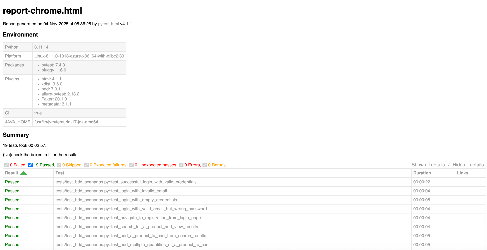

# Selenium BDD WebShop Automation


⬇️ **[Download Latest Release](https://github.com/jingbinw/selenium-bdd-webshop/releases/latest)** | 📋 **[View All Releases](https://github.com/jingbinw/selenium-bdd-webshop/releases)**

A comprehensive Selenium automation testing project using Python, Page Object pattern, BDD (Behavior Driven Development), and Allure reporting. Automates testing for [Demo Web Shop](https://demowebshop.tricentis.com/).

## Demo


## Report


## Features

- **Selenium WebDriver 4.x** with multi-browser support (Chrome, Firefox, Edge)
- **Page Object Pattern** for maintainable code
- **BDD Testing** using pytest-bdd with Gherkin scenarios
- **Allure Reports** with detailed test visualization
- **CI/CD Integration** with GitHub Actions
- **Environment-based Configuration** - no config files needed

## Quick Start

### Prerequisites
- Python 3.11+
- Chrome/Firefox/Edge browser

### Virtual Environment Setup
```bash
# Create virtual environment
python3 -m venv venv

# Activate virtual environment
source venv/bin/activate  # On macOS/Linux
# venv\Scripts\activate   # On Windows

# Upgrade pip
pip install --upgrade pip

# Install dependencies
pip install -r requirements.txt
```

### Setup
```bash
# Install dependencies (if not using virtual environment)
pip install -r requirements.txt

# Configure environment
cp .env.example .env
# Edit .env with your test credentials
```

### Run Tests
```bash
# All tests
pytest tests/ -v

# Specific test types
pytest tests/ -m login -v        # Login tests
pytest tests/ -m shopping -v     # Shopping tests
pytest tests/ -m e2e -v          # End-to-end tests

# Different browsers
BROWSER=firefox pytest tests/ -v
HEADLESS=true pytest tests/ -v   # Headless mode
```

## Reports

```bash
# Allure reports
pytest tests/ --alluredir=reports/allure-results
allure serve reports/allure-results

# HTML reports
pytest tests/ --html=reports/report.html --self-contained-html
```

## Configuration

All configuration via environment variables:

| Variable | Description | Default |
|----------|-------------|---------|
| `TEST_EMAIL` | Test login email | *(required)* |
| `TEST_PASSWORD` | Test login password | *(required)* |
| `BROWSER` | Browser type | chrome |
| `HEADLESS` | Headless mode | false |
| `BASE_URL` | Target website | https://demowebshop.tricentis.com/ |

### Quick Config Examples
```bash
# Minimal setup
echo "TEST_EMAIL=test@example.com" > .env
echo "TEST_PASSWORD=password123" >> .env

# Custom browser
echo "BROWSER=firefox" >> .env
echo "HEADLESS=true" >> .env
```

**Security**: Never commit `.env` files - they're already in `.gitignore`.

## Architecture

### Page Object Pattern
```python
from pages import HomePage, LoginPage

home_page = HomePage(driver)
home_page.search_product("laptop")

login_page = LoginPage(driver)
login_page.login("user@example.com", "password")
```

### BDD Scenarios
```gherkin
Feature: User Login
  Scenario: Successful login
    Given I am on the demo webshop homepage
    When I click on the login link
    And I enter valid login credentials
    Then I should be logged in successfully
```

## Test Scenarios

### Login Tests
- Valid credentials
- Invalid email/password
- Empty credentials

### Shopping Tests
- Product search
- Add to cart
- Quantity modification
- Remove items
- Price validation

### End-to-End
- Complete shopping workflow
- Guest vs authenticated user flows

## CI/CD

GitHub Actions workflow includes:
- Multi-browser testing (Chrome, Firefox)
- Allure report generation
- Failure screenshot capture
- Scheduled daily runs

## Project Structure

```
selenium-bdd-webshop/
├── features/           # BDD scenarios and step definitions
├── pages/             # Page Object Model classes
├── tests/             # Test runners and pytest configuration
├── utils/             # Helper utilities and WebDriver management
├── .env.example       # Environment variables template
└── requirements.txt   # Python dependencies
```

## License

MIT License - see [LICENSE](LICENSE) file for details.


